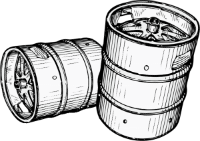

# Keg

[![LICENSE IMAGE]](https://www.npmjs.org/package/vuex-keg)
[](https://app.fossa.io/projects/git%2Bgithub.com%2Fbichikim%2Fkeg?ref=badge_shield)


[NPM IMAGE]:http://img.shields.io/npm/v/vuex-keg.svg?style=shield
[NPM LINK]:https://www.npmjs.org/package/vuex-keg
[LICENSE IMAGE]:https://img.shields.io/npm/l/vuex-keg.svg
[PASSING]:https://circleci.com/gh/bichikim/keg.svg?style=shield&circle-tokrn=15b2464ef42b873445eae4ea8ac5726365199a3a
[PASSING LINK]: https://circleci.com/gh/bichikim/keg

> supporting custom util plugin in Vuex.

## Installation
``
npm i -S vuex-keg
``

``
yarn add vuex-keg
``
## How to Register & Use this
### Basic
```javascript
import Vue from 'vue'
import Vuex from 'vuex'
import VuexKeg, {keg} from './'
Vue.use(Vuex)
const store = new Vuex.Store({
    state: {
      count: 0,
    },
    mutation: {
      increase(state) {
        state.count += 1
      },
    },
    actions: {
      doSayHi: keg(({justSayHi, commit}, payload) => {
        // custom keg util
        justSayHi('foo')
        // do mutation
        commit('increase')
      }),
    },
    plugins: [
      VuexKeg({
        plugins: {
          justSayHi: (store) => (context) => (yourPrams) => (window.console.log('hi!', yourPrams)),
        }
      })
    ],
  }
)
  // result console 'hi!, foo'
```
### Create & Register Keg plugin
```javascript
import Vue from 'vue'
import Vuex from 'vuex'
import VuexKeg from './'

const myPlugins = (pluginOptions) => (store) => {
  // action context & action payload
  return (context, payload) => {
    return (...args) => {
      console.log(`args: ${args}`)
    }
  }
}

const store = new Vuex.Store({
      plugins: [
        VuexKeg({
          plugins: {
            myPlugins: myPlugins({foo: true}),
          }
        })
      ],
})

```
