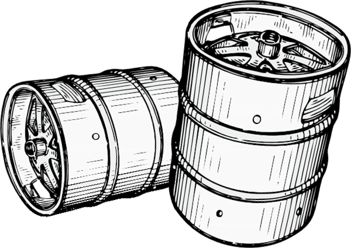

# Keg

> Vuex plugin. It can run a payload function in Mutation Commit

## Installation
``
npm i -S vuex-keg
``

``
yarn add vuex-keg
``
## How to Register & Use this
````javascript
import Vue from 'vue'
import Vuex from 'vuex'
import keg from './index'
Vue.use(Vuex)
const store = new Vuex.Store({
    modules: {
      //...
    },
    actions: {
      doSayHi({commit}, data){
        commit('doSayHi', ({justSayHi, next}) => {
          // do the function
          justSayHi('foo')
          // do mutation with data 
          next({foo: 'yeah!'})
        })
      }
    },
    plugins: [keg({
      plugins: {
        justSayHi: (store) => (mutation, state) => (yourPrams) => (window.console.log('hi!', yourPrams)),
      },
    })],
  })
  // result mutation: {type: 'doSayHi', payload: {foo: 'yeah!'}}
  // result console 'hi!, foo'
````